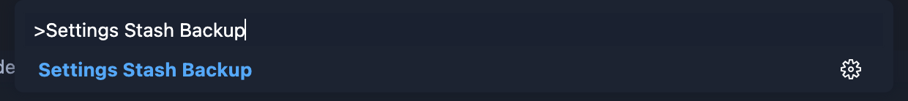
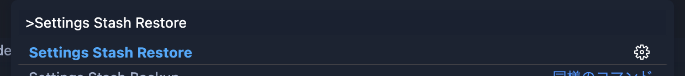

	<h1>Settings Stash</h1>
	
Configuration value saving extension for extension developers.

	

		
		
		
		
	

## Usage

Press `⇧⌘P` to bring up the command pallete and enter `Open Application Settings`, and enter the key of the properties to be evacuated into the `settings-stash.properties.global`.

Press `⇧⌘P` to bring up the command pallete and enter `Settings State Backup`.

The specified property is then evacuated.

After evacuation, change the value of the original property.

Press `⇧⌘P` to bring up the command pallete and enter `Settings State Restore`.

It is restored with the value that was evacuated.

## Uninstall

Press `⇧⌘P` to bring up the command pallete and enter `Settings State Uninstall`.

The data for this extension for erased.

## Caution

### How will this extension affect your environment ?

This extension modifies the following files.

1. settings.json

### Profile configuration files (Profile's settings.json) are not covered

because a dedicated profile is all that is required.

### External libraries used by this extension

1. [vscode/l10n](https://github.com/microsoft/vscode-l10n)
1. [lodash](https://github.com/lodash/lodash)
